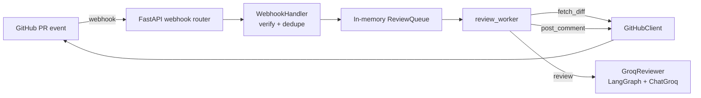

# PR Reviewer — Multi-Agent System

An AI-powered GitHub PR review agent, built incrementally toward the architecture
described in [*Designing an AI Pull-Request Review Agent*](https://www.antern.co/blogs/production-grade-ai-pr-review-agent/).
That write-up derives a full production design — parallel specialist reviewers,
retrieval-grounded context, a confidence-weighted human-in-the-loop gate, and a
single event spine for audit/cost/tracing. This repo builds toward that design
one working phase at a time rather than all at once.

**Current status: single-agent MVP.** One LLM call reviews the whole diff and
posts a comment. The multi-agent split, retrieval, and the rest of the roadmap
below are not built yet — see [Roadmap](#roadmap).

## What it does today

1. Listens for GitHub `pull_request` webhooks (`opened`, `synchronize`,
   `reopened`, `ready_for_review`)
2. Verifies the HMAC-SHA256 signature and drops duplicate deliveries
   (`X-GitHub-Delivery`)
3. Enqueues the event and returns `200` immediately
4. A background worker fetches the PR diff from the GitHub API
5. The diff is reviewed by a Groq-hosted open model, run through a one-node
   LangGraph graph
6. The review is posted back to the PR as a comment



## Architecture

The code follows a ports-and-adapters (hexagonal) layout, which is what makes
the roadmap below additive rather than a rewrite:

- **`domain/`** — framework-agnostic core. `interfaces.py` defines the ports
  (`WebhookVerifier`, `ReviewQueue`, `VCSClient`, `Reviewer`); `models.py`
  defines the data shapes (`PullRequestEvent`, `Review`); `services/` holds
  logic that depends only on those ports.
- **`adapters/`** — concrete implementations of each port (GitHub, the queue,
  the LLM). Swappable without touching `domain/`.
- **`api/`** — the FastAPI HTTP layer; delegates everything to `WebhookHandler`.
- **`workers/`** — drains the queue and drives a review end-to-end.
- **`main.py`** — the composition root; the only file that imports both ports
  and concrete adapters and wires them together.

## Project structure

```
pr_reviewer/
├── main.py                          # composition root
├── config.py                        # settings (GITHUB_WEBHOOK_SECRET, etc.)
├── api/
│   └── webhook_router.py            # POST /webhook/github
├── domain/
│   ├── models.py                    # PullRequestEvent, Review
│   ├── interfaces.py                # WebhookVerifier, ReviewQueue, VCSClient, Reviewer
│   └── services/
│       └── webhook_handler.py       # verify -> dedupe -> parse -> filter -> enqueue
├── adapters/
│   ├── github/
│   │   ├── signature_verifier.py    # HMAC-SHA256 verification
│   │   ├── payload_parser.py        # raw JSON -> PullRequestEvent
│   │   └── github_client.py         # fetch_diff, post_comment
│   ├── queue/
│   │   └── in_memory_queue.py       # process-local ReviewQueue
│   └── llm/
│       └── groq_reviewer.py         # Reviewer via LangGraph + ChatGroq
└── workers/
    └── review_worker.py             # fetch -> review -> post, in a loop
```

## Setup

```bash
git clone <this repo>
cd <this repo>
python -m venv .venv && source .venv/bin/activate
pip install -r requirements.txt
```

Create a `.env` file in the project root:

```bash
GITHUB_TOKEN=ghp_...              # classic PAT, repo or public_repo scope
GITHUB_WEBHOOK_SECRET=...          # must match the secret set on the GitHub webhook
GROQ_API_KEY=gsk_...               # console.groq.com/keys
```

Run the app:

```bash
uvicorn pr_reviewer.main:app --reload
```

Expose it for GitHub to reach (local dev):

```bash
ngrok http 8000
```

Then, on the repo: **Settings → Webhooks → Add webhook**
- Payload URL: `https://<your-ngrok-domain>/webhook/github`
- Content type: `application/json`
- Secret: same value as `GITHUB_WEBHOOK_SECRET`
- Events: just the **Pull requests** event

Open or update a PR on that repo and watch the worker log a fetch, a review,
and a posted comment.

## Roadmap

Tracking the phases from the design doc this project follows. Unchecked items
are the next honest steps, not aspirational scope creep — each one is meant to
land as a single additive change against the existing ports.

- [x] Webhook ingress: HMAC verification, idempotency, fast ack
- [x] End-to-end loop: fetch diff → single LLM review → post comment
- [x] Orchestration seed: LangGraph graph (currently one node)
- [ ] Queue: swap `InMemoryReviewQueue` for Redis-backed, decouple worker into
      its own process
- [ ] Structured `Finding` contract (severity, category, file/line, confidence,
      rationale) instead of one free-text summary
- [ ] Multi-agent split: security / quality / tests / docs specialists running
      in parallel, merged by an aggregator
- [ ] Retrieval (RAG): ground each specialist in relevant repo context instead
      of the bare diff
- [ ] Confidence-weighted human-in-the-loop gate: auto-post when confident,
      route to a review queue otherwise
- [ ] Observability: an event log for every LLM/tool call, feeding a trace
      view, an audit trail, and cost tracking
- [ ] Reliability layer: retries with backoff, circuit breakers, and
      fault-tolerant handling around the Groq and GitHub calls
